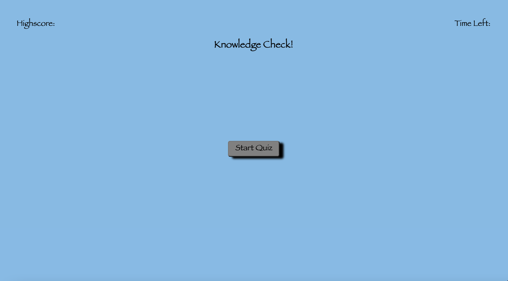

# timed-quiz

## Description

This webpage was created to present a timed quiz based on the acquired skills learned in class. This webpage contains a series of questions regarding topics of coding the class has already learned. The webpage then notifies the user wether their answer to each question is correct or incorrect. Selecting an incorrect answer results in a deduction of 5 seconds on the overall time. Once the quiz is finished, a form populates asking the user to submit their initials and time left of the score. This challenge tested the attentative quality of the student as well as giving the student a scenario they would encounter in their career.

## Tasks
- Display the knowledge on how to create a function.
- Access local storage to store and retrieve information from.
- Create a timed quiz for the user to interact with.

## Usage

https://izbeloro.github.io/timed-quiz/

## Credits

- https://developer.mozilla.org/en-US/docs/Web/CSS/display#description
- https://stackoverflow.com/questions/44314897/javascript-timer-for-a-quiz
- https://www.codingnepalweb.com/quiz-app-with-timer-javascript/
- https://www.makeareadme.com/

## License

MIT License

Copyright (c) [2022] [SamanthaOrozco]

Permission is hereby granted, free of charge, to any person obtaining a copy
of this software and associated documentation files (the "Software"), to deal
in the Software without restriction, including without limitation the rights
to use, copy, modify, merge, publish, distribute, sublicense, and/or sell
copies of the Software, and to permit persons to whom the Software is
furnished to do so, subject to the following conditions:

The above copyright notice and this permission notice shall be included in all
copies or substantial portions of the Software.

THE SOFTWARE IS PROVIDED "AS IS", WITHOUT WARRANTY OF ANY KIND, EXPRESS OR
IMPLIED, INCLUDING BUT NOT LIMITED TO THE WARRANTIES OF MERCHANTABILITY,
FITNESS FOR A PARTICULAR PURPOSE AND NONINFRINGEMENT. IN NO EVENT SHALL THE
AUTHORS OR COPYRIGHT HOLDERS BE LIABLE FOR ANY CLAIM, DAMAGES OR OTHER
LIABILITY, WHETHER IN AN ACTION OF CONTRACT, TORT OR OTHERWISE, ARISING FROM,
OUT OF OR IN CONNECTION WITH THE SOFTWARE OR THE USE OR OTHER DEALINGS IN THE
SOFTWARE.